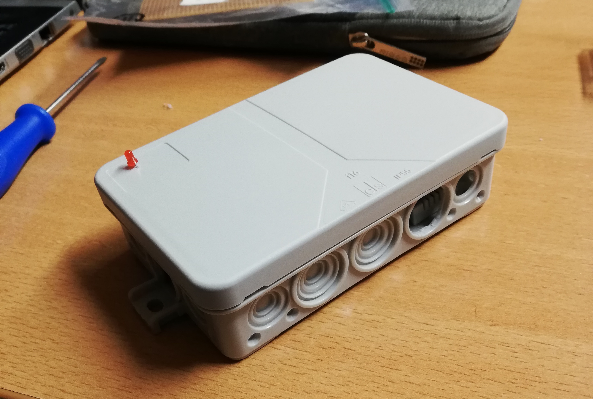
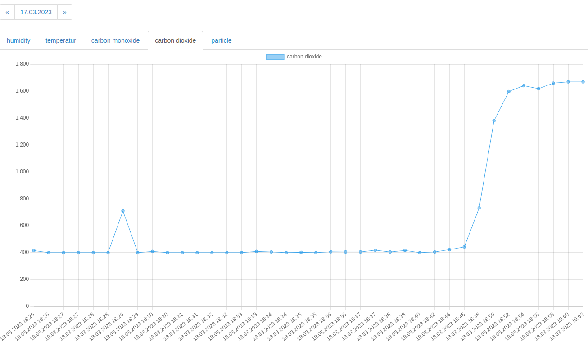
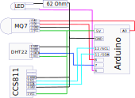
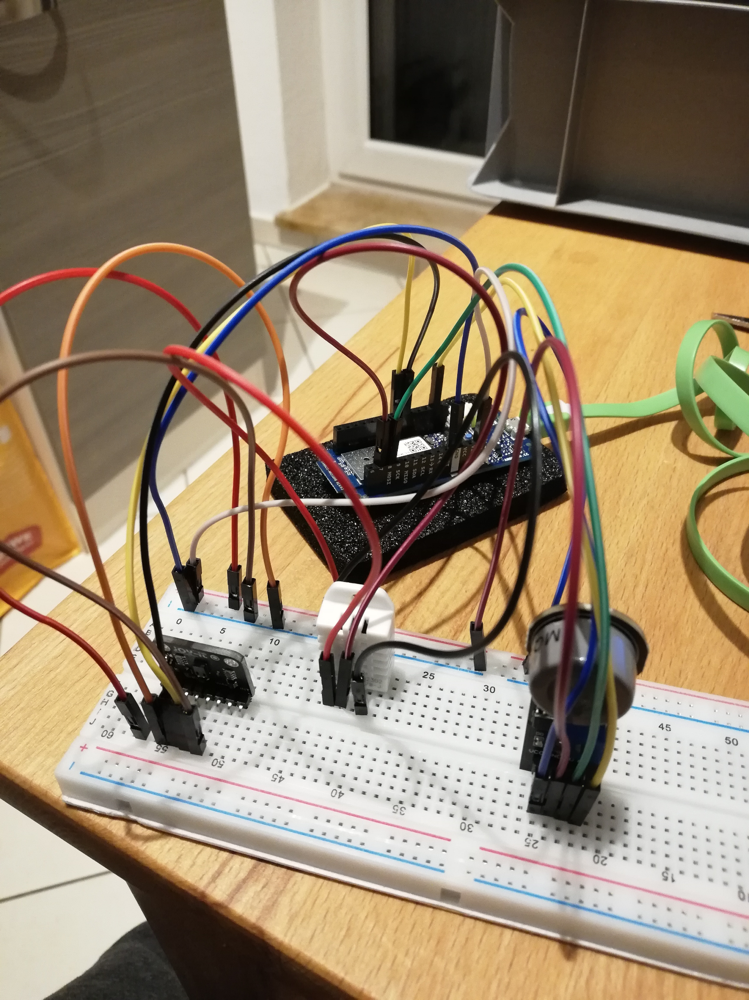
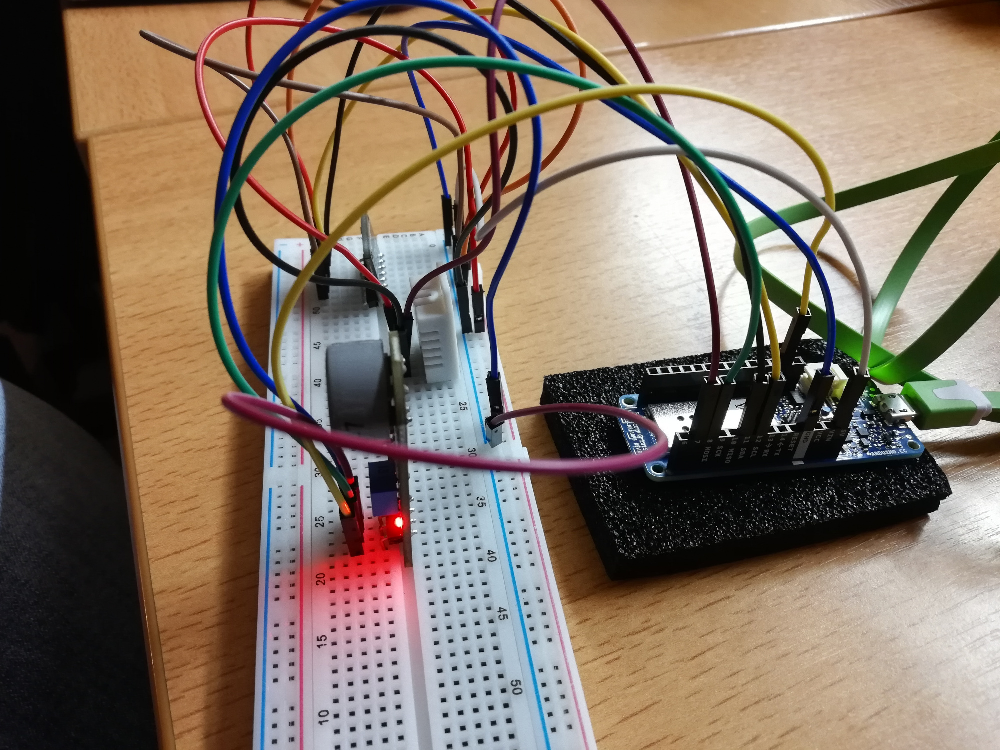
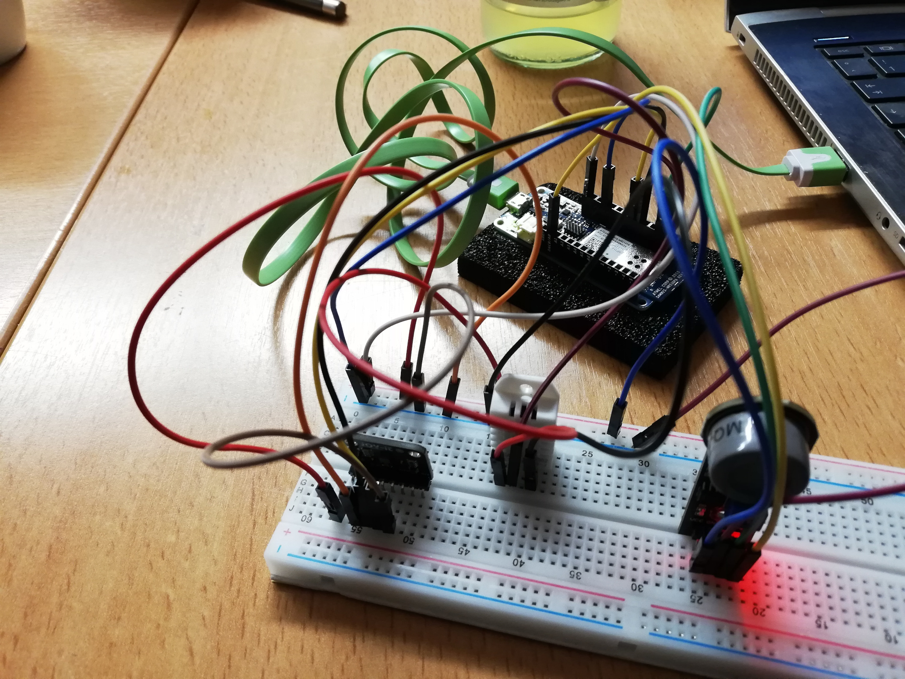
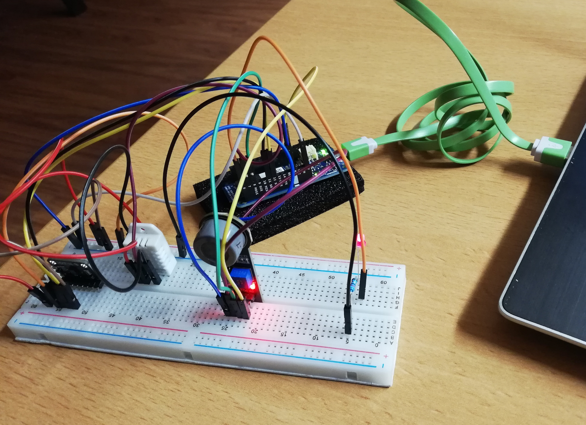
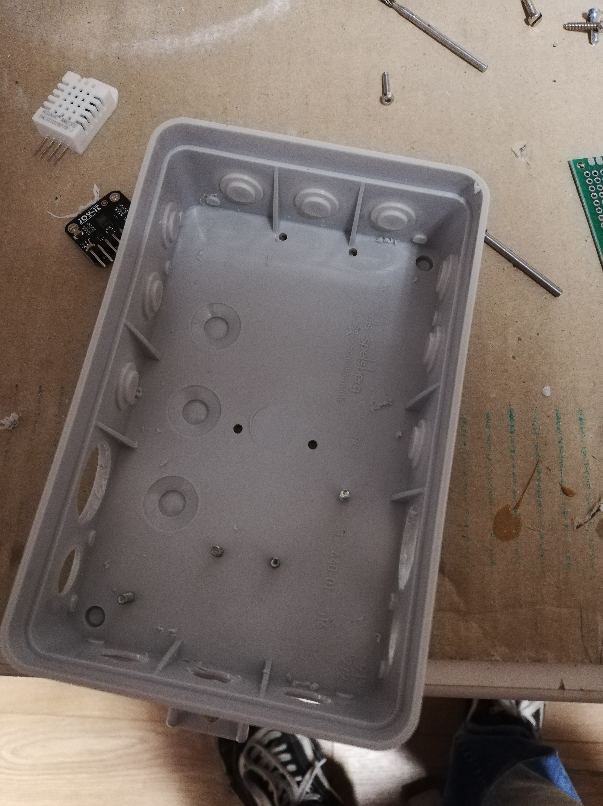
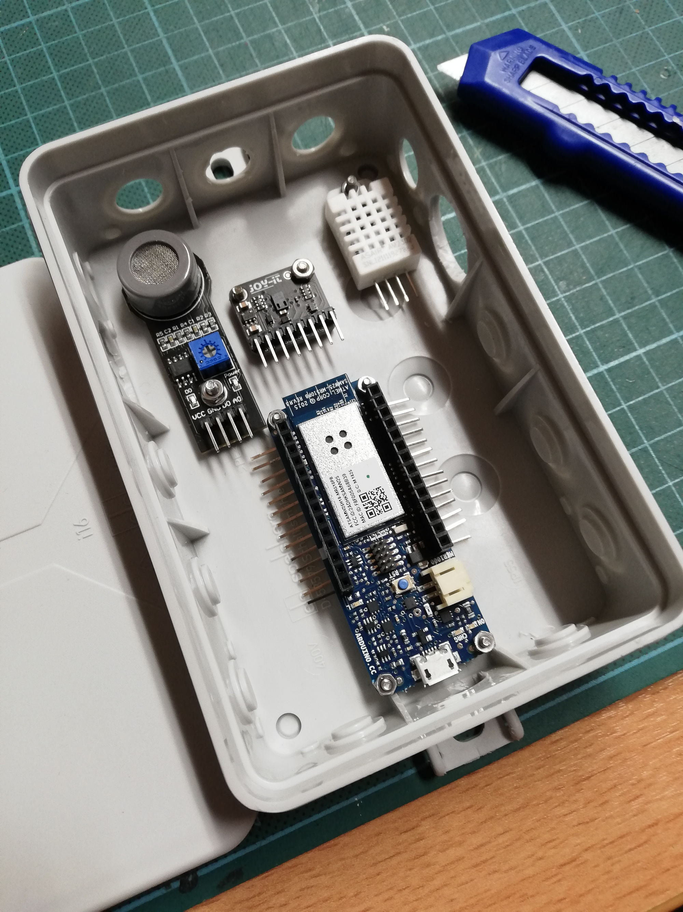
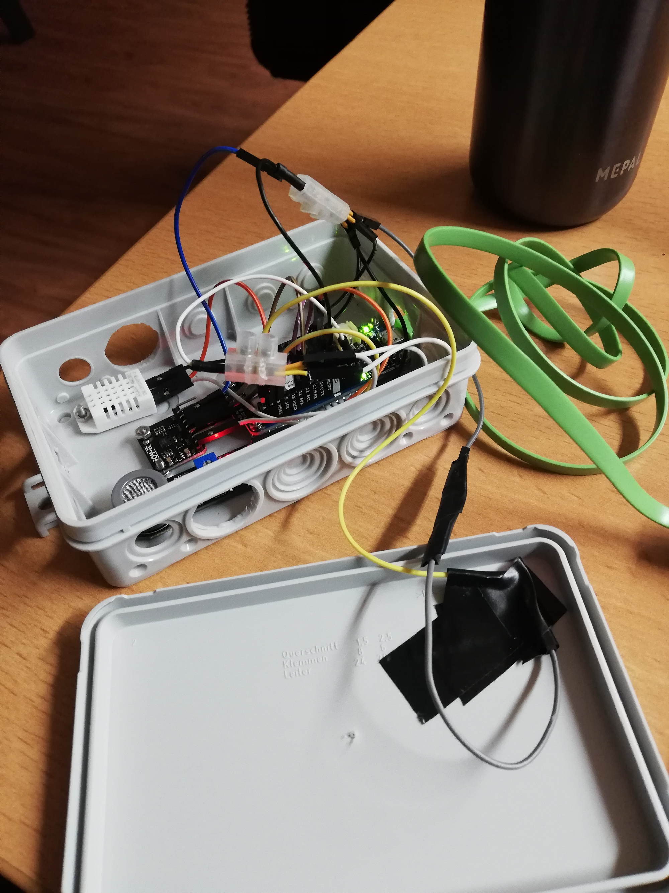

# Arduino Air Sensor

[](https://falk-m.de)
[](LICENSE)
[](https://eigenbaukombinat.de/)

In this project i developed a arduino sensor box to mesure temperatur, co2, co, humidity and particle.

the box


web interface


## Installation

- Web application
  - copy config.dist.php and rename to config.php
  - set a random selected secret key in this config.php
  - start it over ```docker-compose up``` or copy the "Webserver" folder to yor webserver
    - make sure, that the "Webserver/store" folder have writeable rights
- Arduino programm
  - copy arduino_secrets.dist.h and rename to arduino_secrets.h
  - insert your wifi connection data, the host and path to the webapplication and the same secret key from the config.php
  - install the programm on the arduino

## Helpful

- ```nmcli device wifi show-password```: This command display the current connectet wifi ssid and password
- ```dmesg -wH```: list usb devices. If you connect your arduino and nothing happens, then you use a not compatible wire

## Shopping List

| Number | Name | Quanity | Price |
|---|---|---|---|
| [ARD MKR1000 WH](https://www.reichelt.de/arduino-mkr1000-wifi-samd21-cortex-m0-32-bit-arm-ard-mkr1000-wh-p230558.html?&trstct=pos_0&nbc=1) | Arduino MKR1000 WiFi, SAMD21 Cortex-M0+ 32 bit ARM | 1 | 30,70 € |
| [DEBO GAS MQ7](https://www.reichelt.de/entwicklerboards-gassensor-kohlenmonoxid-mq-7-debo-gas-mq7-p280115.html?&trstct=pos_0&nbc=1) | Gassensor, Kohlenmonoxid, MQ-7 | 1 | 4,85 € |
| [DEBO DHT 22](https://www.reichelt.de/entwicklerboards-temperatur-feuchtigkeitssensor-dht22-debo-dht-22-p224218.html?&trstct=pos_0&nbc=1) | Temperatur- & Feuchtigkeitssensor, DHT22 | 1 | 6,80 € |
| [DEBO SENS CCS811](https://www.reichelt.de/entwicklerboards-sensor-fuer-luftqualitaet-ccs811-debo-sens-ccs811-p253655.html?&trstct=pos_0&nbc=1) | Sensor für Luftqualität, CCS811 | 1 | 17,10 € |
| [RASP NT 25 SW E](https://www.reichelt.de/raspberry-pi-netzteil-5-v-2-5-a-micro-usb-schwarz-rasp-nt-25-sw-e-p240934.html?&trstct=pos_0&nbc=1) | Raspberry Pi - Netzteil, 5 V, 2,5 A, Micro-USB, schwarz | 1 | 5,50 € |
| [VI MBB02070C6209](https://www.reichelt.de/duennschichtwiderstand-axial-0-6-w-62-ohm-1--vi-mbb02070c6209-p233762.html?&trstct=pos_0&nbc=1) | Dünnschichtwiderstand, axial, 0,6 W, 62 Ohm, 1% | 1 | 0,05 € |
| [WUE 151031SS0600](https://www.reichelt.de/led-3-mm-bedrahtet-rot-9-mcd-60--wue-151031ss0600-p230886.html) | LED, 3 mm, bedrahtet, rot, 9 mcd, 60° | 1 | 0,35 € |
| [DEBO KABELSET8](https://www.reichelt.de/entwicklerboards-steckbrueckenkabel-20cm-3x-20-kabel-debo-kabelset8-p280591.html) | Steckbrückenkabel, 20cm, 3x 20 Kabel | 1 | 5,99 € |
| [6072863](https://www.hornbach.de/p/spelsberg-feuchtraum-verbindungsdose-ip55-130x85x37-mm-grau-33391601-ohne-klemmen-16-einfuehrungen/6072863/) | Spelsberg Feuchtraum Verbindungsdose IP55 130x85x37 mm grau 33391601 ohne Klemmen 16 Einführungen | 1 | 1,45 € |

# circuit



| DHT | Arduino |
|---|---|
| 1 | input |
| 2 | 7 |
| 4 | GND |

| MQ7 | Arduino |
|---|---|
| 1 | input |
| 2 | GND |
| 3 | 8 |
| 4 | A0 |

| CCS811 | Arduino |
|---|---|
| 1 | input |
| 3 | GND |
| 4 | 11 |
| 5 | 12 |
| 6 | GND |

| LED | Arduino |
|---|---|
| short | 62 Ohm => GND |
| long | 6 |

## Images








